# Rocket Sim

An interactive axisymmetric compressible-flow sandbox for a rocket's aft end. A hot-gas injector
feeds a combustion chamber and a converging-diverging nozzle whose shape is set by sliders,
while the vehicle flies nose-first through a selectable atmosphere. Exhaust and atmosphere are
separate gases, each with its own ratio of specific heats and molecular weight, so the plume
boundary is a contact surface between two different fluids.

Runs in the browser on WebGPU.


The 1-D isentropic figures are shown next to the simulated ones, so the cases where they diverge
are visible.

Measured performance, grid convergence and solver checks are in
[docs/validation.md](docs/validation.md).

## Requirements

Open `index.html`. No build step, no server, no dependencies.

WebGPU is required: Chrome 113+, Edge 113+, Safari 26+, or Firefox 141+ on Windows. Firefox on
Linux may need `dom.webgpu.enabled`.

---

## Geometry

The view is a slice through the axis, mirrored about the centreline. Grey hatching is hardware,
the orange band at the head of the chamber is the injector plenum, and the vertical yellow line
is the measurement plane.


Nose to tail: a nose cone (flat, pointy or rounded), a solid forebody, the combustion chamber
with the injector plenum at its head, a converging section, the throat, and the diverging bell.
Atmosphere enters at the left at the flight speed, flows over the vehicle and meets the exhaust
at the base.

Body radius is `max(chamber, nozzle exit) + wall thickness`, so the base is always an annulus
and there is always a base region between the plume and the external flow.

The injector is a band of cells held at a stagnation pressure and temperature. The flux kernels
treat it as ordinary fluid, so mass flow through the nozzle is an output rather than an input.

### Parameters

| group | contents |
|---|---|
| Chamber & injector | chamber pressure, ignition rise time, chamber radius and length |
| Propellant | six exhaust compositions as buttons; flame temperature, γ and R directly |
| Nozzle | throat radius, exit radius, converging and diverging lengths, conical / bell / aerospike, spike truncation |
| Airframe | nose cone shape and length, forebody length, wall thickness |
| Atmosphere | six worlds as buttons; ambient pressure (log, 10 Pa to 10 MPa), temperature, flight speed, surface gravity, γ and R directly |
| Vehicle & flight | acceleration on/off, level / vertical / gravity-turn path, pitch-over speed and angle, dry and propellant mass, trajectory fast-forward |
| Fluid | viscosity, Smagorinsky constant, tracer fade |
| Domain & solver | plume domain length, radial domain, axial cell stretch, radial cells, CFL, frame budget |
| Measurement | position of the measurement plane relative to the exit |

---

## Expansion ratio and ambient pressure

Same chamber and throat, three relationships between exit pressure and ambient.

Matched, the default. Exit pressure 1.01× ambient. The plume leaves parallel with weak shock
cells and a shear layer rolling up against still air.

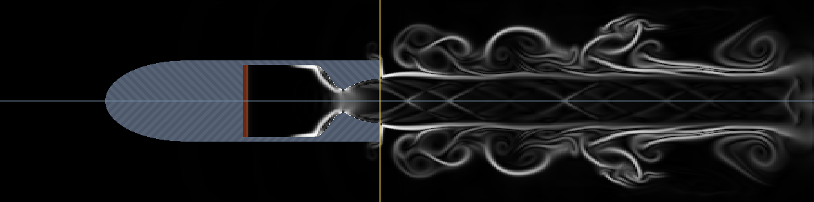

Over-expanded: a 40:1 vacuum bell at sea level, exit pressure 0.04× ambient. The jet cannot fill
the nozzle. It separates from the wall shortly past the throat and the rest of the bell contains
recirculating gas.

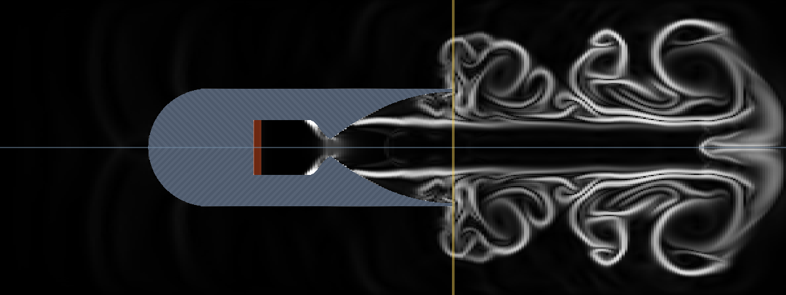

Under-expanded: a stubby nozzle at 60 bar, exit pressure 10.9× ambient. The plume continues to
expand outside through a Prandtl-Meyer fan, overshoots, and recompresses into a train of shock
diamonds.

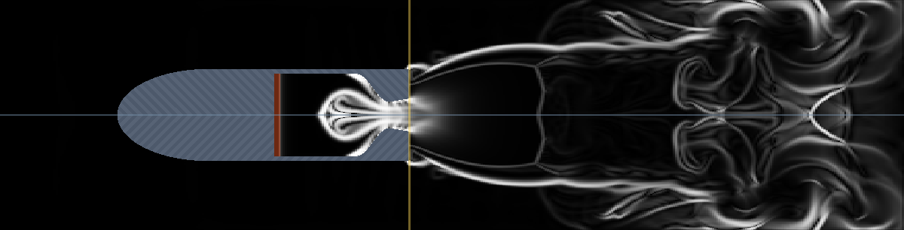

### Aerospike

An aerospike replaces the outer wall of the divergent section with the ambient. Flow leaves an
annular throat at the cowl lip and expands along a centrebody, so the outer boundary of the
plume is set by ambient pressure rather than by a wall.


Throat radius and exit radius keep their meaning. The exit radius is the cowl lip, and the
spike root radius follows as √(exit² − throat²), which makes the annular throat area equal to
π·throat². Expansion ratio, choked mass flow and the 1-D performance figures are therefore the
same as for a bell with the same two radii, and describe the design point.

The geometry: the centrebody grows from the axis through the contraction, reaching its root
radius at the throat, then tapers as (1−s)². **Spike length built** truncates the contour early
and leaves a base, as real plug nozzles do to save mass.

Two consequences for the measurements:

- The annular throat is much thinner than a circular throat of the same area, and gets thinner
  as expansion ratio rises: at ε 3.4 the gap is a quarter of the throat radius. Plug nozzles
  need more radial resolution than bells. The panel reports cells across the gap.
- The plume has no wall to bound it, so the exit-plane integrals are bounded by the exhaust
  tracer rather than by the exit radius. The panel reports the plume radius it found.

The contour is a simple algebraic curve with an axial throat, not a method-of-characteristics
design with an inclined throat. It recovers about 85 % of ideal exhaust velocity where a bell
of the same expansion ratio recovers 96 %. See [docs/validation.md](docs/validation.md).

### Presets

Nine, each setting nozzle, chamber, propellant and atmosphere together.

| preset | configuration |
|---|---|
| Sea-level booster | kerolox on Earth, ε 3.4, matched, Isp 251 s |
| Vacuum upper stage | hydrolox at 1 kPa, ε 40, Isp 442 s. Under-expanded, since the optimum ε in vacuum is unbounded and real vacuum nozzles are truncated for mass |
| Over-expanded | the same hydrolox bell at sea level: separation, shock system inside the nozzle |
| Under-expanded | stubby kerolox at 60 bar, shock-diamond train |
| Supersonic flight | pointy nose at Mach 2 at 10 km: bow shock, shoulder expansion, base flow |
| Mars ascent | methalox into 0.64 kPa of CO₂, pressure ratio 3141 |
| Venus surface | 250 bar against 92 bar back pressure, ε 1.1, Isp 159 s |
| Aerospike | plug nozzle, ε 3.4, matched at sea level |
| Titan flight | methalox at Mach 1.5 through cold dense nitrogen, with entrainment |

---

## Flight

Set an ambient air speed and the nose cone affects the flow, and the base becomes an interaction
between the external flow and the plume.

Three nose shapes at Mach 2 at about 10 km, otherwise identical.

Flat: a detached bow shock with a subsonic pocket behind it.

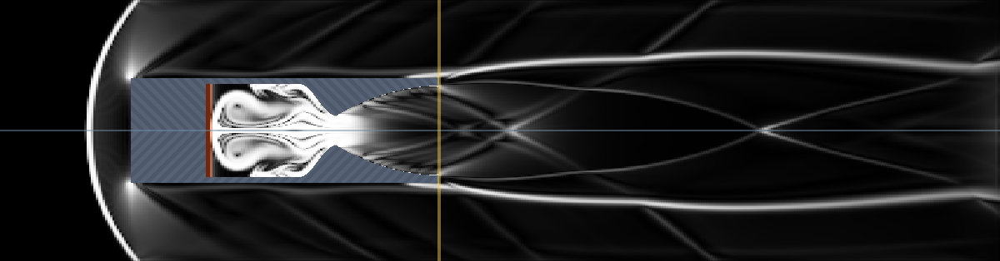

Pointy: the shock attaches at the tip and lies along the cone.

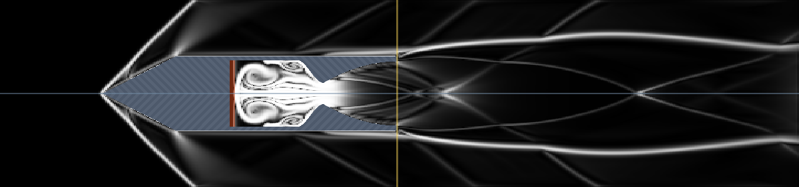

Rounded: ellipsoidal, zero slope at the shoulder.

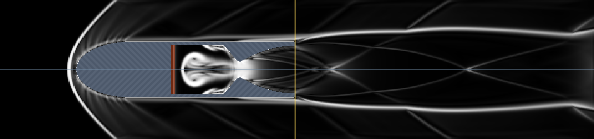

In all three the external flow separates off the base annulus and the plume acts as an
aerodynamic body.

### Thrust and drag

Two integrals over separate surfaces.

**Thrust** is the momentum-plus-pressure integral across the nozzle exit plane,
∫(ρu² + p − p_ambient) dA, bounded by the exit radius for a bell and by the exhaust tracer for
a plug nozzle.

**Drag** is the (p − p_ambient) integral over the external wetted surface: nose, body and base
annulus. It is computed one axial slab per thread. Each slab's surface spans a range of radii,
and the axial force is the gauge pressure over that ring's projected area, signed by whether the
ring faces forward or aft. Pressure is sampled from the fluid cell adjacent to the surface on
the flow side: upstream of a forward-facing ring, aft of the base. The surface radius is defined
as zero ahead of the nose and as the nozzle exit radius aft of the base, so the slabs telescope
and a uniform ambient pressure integrates to zero net force.

Skin friction is excluded. The boundary layer is unresolved at this cell size, so a wall-shear
figure would depend on the grid rather than the flow. Reported drag is pressure drag, which is
the term that responds to nose shape at supersonic speed. Total drag on a slender body is
typically about a third higher.

### Trajectory

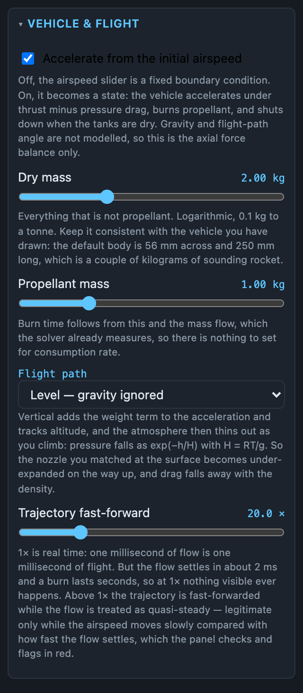

With **accelerate** on, airspeed becomes a state variable rather than a boundary condition. The
vehicle accelerates under thrust minus drag, consumes propellant at the measured mass flow, and
shuts the chamber down when the tanks are empty, ramped down over the ignition time rather than
cut. There is no consumption-rate input because mass flow is an output of the solver. Reported
Δv is the propulsive figure, with no gravity or drag losses subtracted.

Three flight paths:

- **Level**: axial force balance only, gravity ignored.
- **Vertical**: adds the weight term and tracks altitude.
- **Gravity turn**: as vertical, with weight also rotating the flight path.

On both climbing paths, ambient pressure falls as exp(−h/H), so a nozzle matched at the surface
becomes under-expanded with altitude while drag falls with density. Altitude is measured from
the start of the run. Gravity is constant with altitude; over the few kilometres a burn of this
size covers, the inverse-square correction is a fraction of a percent.

A vertical launch from the Earth surface at 3162× fast-forward, 2 kg dry and 1 kg of kerolox:

| flight time | altitude | airspeed | ambient | thrust | drag | state |
|---|---|---|---|---|---|---|
| T+3.7 s | 0.6 km | 426 m/s | 93 % | 484 N | 98 N | climbing, T/W 16.3 |
| T+5.6 s | 1.7 km | 673 m/s | 82 % | 493 N | 284 N | tanks nearly dry |
| T+7.5 s | 3.0 km | 607 m/s | 70 % | 13 N | 260 N | burnt out, coasting |
| T+11.3 s | 4.7 km | 348 m/s | 57 % | −2 N | 100 N | coasting |

Thrust rises slightly with altitude as back pressure falls; drag peaks and then falls with
density; after burnout the vehicle coasts under drag and weight.

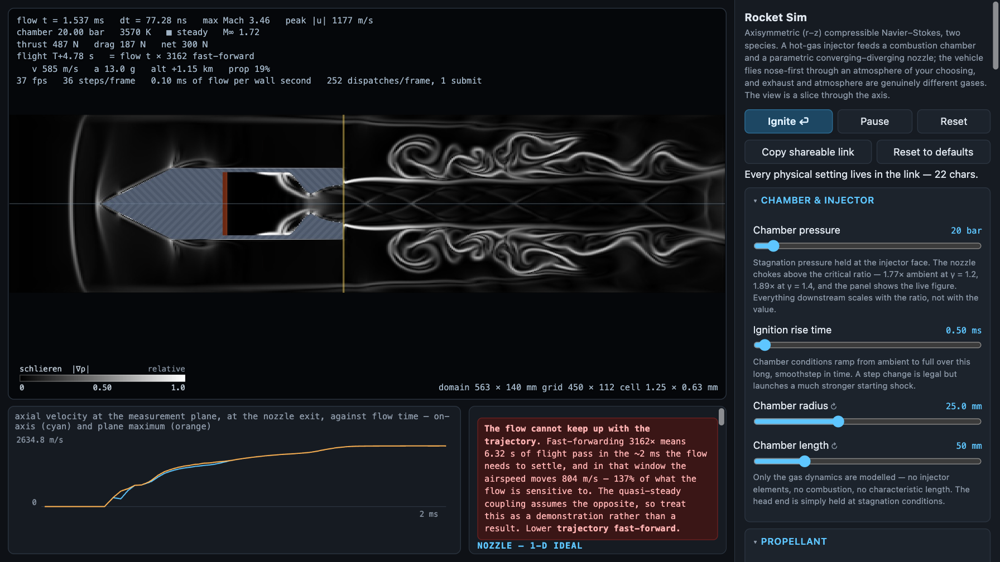

### Gravity turn

With the flight path exactly vertical, weight is parallel to the velocity and there is no
component to rotate it, so the turn is started by an explicit pitch-over. Set the airspeed at
which it happens and the angle it applies. Thereafter:

```
dv/dt   = (F − D)/m − g·sin γ
dγ/dt   = −g·cos γ / v
```

with γ the flight-path angle from horizontal. The same vehicle, kicked 25° at 50 m/s:

| flight time | γ | altitude | downrange | airspeed | ambient |
|---|---|---|---|---|---|
| T+1.8 s | 63.7° | 0.05 km | 0.02 km | 129 m/s | 99 % |
| T+4.7 s | 61.2° | 0.94 km | 0.49 km | 561 m/s | 89 % |
| T+7.5 s | 60.0° | 2.59 km | 1.42 km | 602 m/s | 74 % |
| T+13.2 s | 55.6° | 4.52 km | 2.61 km | 301 m/s | 59 % |

Turn rate goes as 1/v, so most of the rotation occurs late in the trajectory.

A gravity turn is flown at zero angle of attack, with the body axis along the velocity vector,
which is the configuration an axisymmetric solver with an axial freestream represents. A
vertical climb is also valid until it runs out of speed: the solver represents nose-first flight
only, so it terminates at apogee rather than reversing.

Three conditions are reported rather than extrapolated through: thrust-to-weight below 1 on the
pad, apogee on a vertical climb, and a turn returning to ground level.

### Exit-plane integral after burnout

With the chamber ramped down to ambient the nozzle is an open duct with ambient gas passing
through it, and ∫(ρu² + p − p_ambient) dA reads a small negative value, of order a few newtons.
This is internal drag on a shut-down engine, and the panel and readout label it as such.

### Clocks

Three, each named wherever it appears.

- **Flow time**, milliseconds. The CFD clock: the interval of gas dynamics simulated. Labels the
  readout and the plot axis.
- **Flight time**, seconds. The trajectory clock.
- **Wall time**. Appears only as `ms of flow per wall second`.

Flow and flight advance together only at 1× fast-forward. The flow settles in about 2 ms and a
burn lasts seconds, so reaching trajectory timescales requires a higher factor. The readout
prints it:

```
flow t = 1.537 ms
flight T+4.78 s   = flow t × 3162 fast-forward
```

The coupling is quasi-steady, valid while the airspeed and ambient pressure change slowly
relative to the settling time. The panel computes how far each moves during one settling time
and flags the configuration past 5 %. The tables above were run at 3162×, past that threshold,
and are demonstrations rather than measurements.

---

## Two gases

Y is the exhaust mass fraction, carried as ρY, and sets the local equation of state. For a
mixture of two calorically perfect gases at a common temperature the specific heats add by mass
fraction:

```
cv = Y·cv_e + (1−Y)·cv_a        R = Y·R_e + (1−Y)·R_a
γ  = (cv + R) / cv              p = ρRT = (γ−1)ρe
```

A contact surface between plume and atmosphere is therefore a jump in the equation of state as
well as in temperature. Two rows of buttons set the two ends:

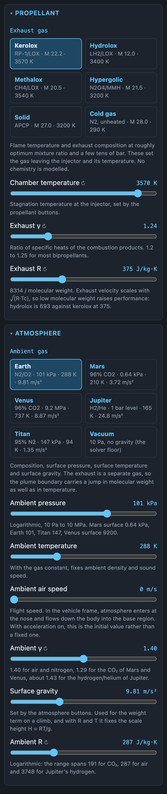

### Propellants

Composition at roughly optimum mixture ratio and a few tens of bar. No chemistry is modelled;
the buttons set the gas leaving the injector and its temperature.

| propellant | γ | M (g/mol) | T_c (K) |
|---|---|---|---|
| Kerolox, RP-1/LOX | 1.24 | 22.2 | 3570 |
| Hydrolox, LH2/LOX | 1.22 | 12.0 | 3400 |
| Methalox, CH4/LOX | 1.20 | 20.5 | 3540 |
| Hypergolic, N2O4/MMH | 1.23 | 21.5 | 3200 |
| Solid, APCP | 1.18 | 27.0 | 3200 |
| Cold gas, N₂ | 1.40 | 28.0 | 290 |

Resulting c\* and Isp against published engine figures are in
[docs/validation.md](docs/validation.md).

### Atmospheres

| world | composition | γ | M (g/mol) | pressure | T | ρ | sound speed | g | scale height | p_c to choke |
|---|---|---|---|---|---|---|---|---|---|---|
| Earth | N₂/O₂ | 1.40 | 29.0 | 101 kPa | 288 K | 1.23 kg/m³ | 340 m/s | 9.81 | 8.4 km | 1.8 bar |
| Mars | 96% CO₂ | 1.29 | 43.4 | 0.64 kPa | 210 K | 0.016 kg/m³ | 228 m/s | 3.72 | 10.8 km | 0.01 bar |
| Venus | 96% CO₂ | 1.29 | 43.4 | 9.2 MPa | 737 K | 65.2 kg/m³ | 427 m/s | 8.87 | 15.9 km | 165 bar |
| Jupiter | 89% H₂, 10% He | 1.43 | 2.22 | 1 bar level | 165 K | 0.162 kg/m³ | 941 m/s | 24.8 | 25 km | 1.8 bar |
| Titan | 95% N₂ | 1.40 | 27.3 | 147 kPa | 94 K | 5.12 kg/m³ | 200 m/s | 1.35 | 21.2 km | 2.6 bar |
| Vacuum | | | | 10 Pa | | 10⁻⁴ kg/m³ | | 0 | | none |

Scale height is derived rather than input: H = RT/g from the gas constant, temperature and
gravity already set. It reproduces published figures to within a few percent (8.4 km for Earth
against a measured 8.5, 15.9 for Venus against 15.9, 21.2 for Titan against 21).

The last column follows from the critical pressure ratio of about 1.8. On the Venus surface an
engine below 165 bar chamber pressure does not choke: the throat stays subsonic and the bell
acts as a diffuser.

### Same engine, three atmospheres

Identical kerolox engine and nozzle at steady state, schlieren.

Earth, 101 kPa. ε 3.4 is matched here.


Mars, 0.64 kPa, a pressure ratio of 3141. A 40:1 bell cannot expand against this, so the plume
continues expanding after it leaves.

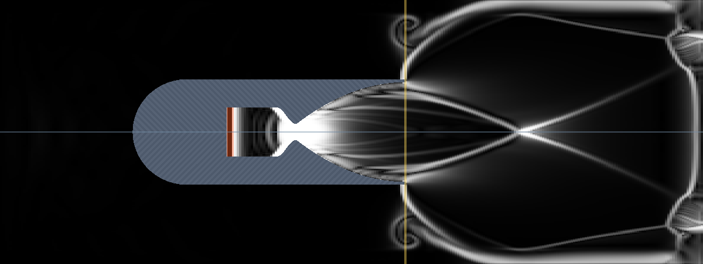

Venus, 92 bar. At 250 bar chamber pressure the pressure ratio is 2.7, barely above choking, so
the optimum expansion ratio is 1.1. Exhaust velocity is 1123 m/s and Isp 159 s. The atmosphere
is denser than the exhaust.

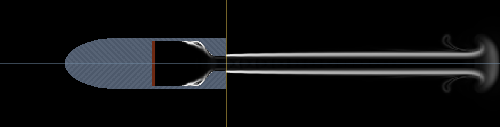

### Same engine, same back pressure, different ambient gas

Both are the default kerolox engine at 1 bar back pressure, so the internal nozzle flow is
identical. Earth air is M 29 with a sound speed of 340 m/s, so the plume is hypersonic relative
to it and the shear layer breaks up within a few diameters (image above). Jupiter's hydrogen is
M 2.22 with a sound speed of 941 m/s, so the same plume is only mildly supersonic relative to
the ambient, the shear layer stays thin, and the shock-cell train persists the length of the
domain:

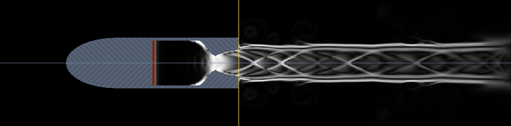

A single-gas model cannot reproduce this. With one γ and one R the plume boundary carries only a
temperature jump; here it carries a factor of thirteen in molecular weight.

### Mixing

Exhaust fraction on Titan at Mach 1.5, where ambient nitrogen is 5.1 kg/m³. The bright core is
pure exhaust; the fade is entrainment. At the exit plane the axis is 84 % exhaust.

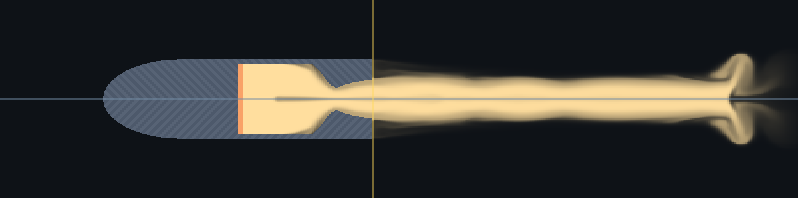

Species diffusion runs at unity Schmidt number on the same eddy viscosity as the momentum
equations.

---

## Fields

Eight views of the same instant. Switching does not disturb the run.

| | |
|---|---|
| **Mach**: sonic line in the throat, and where the plume goes supersonic. White contour at M = 1. 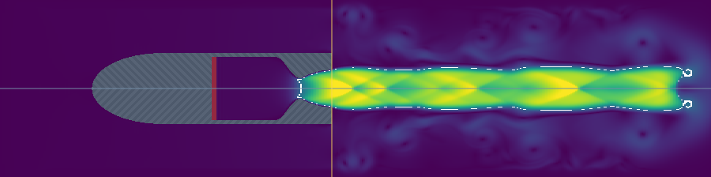 | **Schlieren**: shocks. Bow shocks, lip shocks, diamonds, Mach discs.  |
| **Temperature**: chamber heat, plume cooling, recovery temperature on the nose. 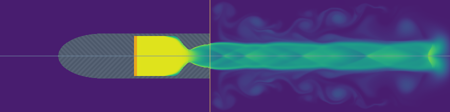 | **Exhaust fraction**: propellant distribution and entrained ambient air. 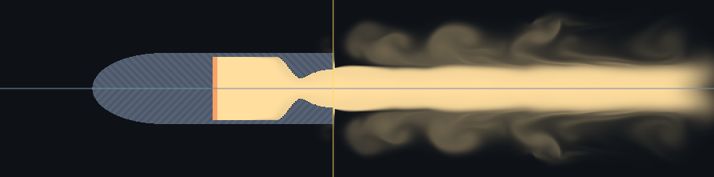 |

Also available: speed |u|, pressure relative to ambient, axial velocity, and vorticity. Each
field is drawn with a legend giving quantity, units and the numeric range used that frame.

## Readouts

Two blocks of figures and a time series of axial velocity at the measurement plane.

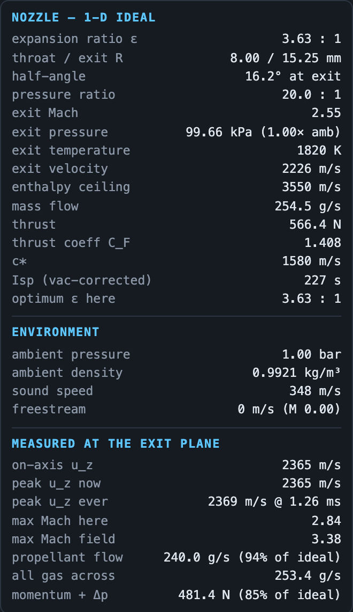

**Nozzle, 1-D ideal** is isentropic theory: expansion ratio, exit Mach from the area-Mach
relation, exit pressure, temperature and velocity, choked mass flow, thrust, thrust coefficient,
c\*, Isp, and the expansion ratio that would be optimum at the current ambient pressure. Exact
under their assumptions of no separation, no boundary layer and a uniform exit.

**Gases** and **Atmosphere** give the properties the gas sliders imply, including density, sound
speed and scale height.

**Measured** is what the grid produced: on-axis and peak axial velocity, peak Mach at the plane
and in the field, two mass flows, thrust, pressure drag and net axial force.

The two mass flows differ. `propellant flow` is weighted by the exhaust tracer and is comparable
with the choked-throat figure; `all gas across` is everything crossing the plane. Divergence
between them indicates entrained ambient air, which occurs when the jet is separated or badly
expanded.

**Flight** gives airspeed, current mass, burn time, thrust-to-weight, acceleration, measured Isp
and ideal Δv, plus altitude, flight-path angle, downrange and ambient pressure when climbing.

### Warnings

Conditions flagged: unchoked nozzle, separation past the Summerfield criterion, over- and
under-expansion, conical half-angle costing significant momentum, under-resolved throat,
transonic freestream, burnout, failure to lift off, apogee, ground impact, and violation of the
quasi-steady assumption. Warnings that invalidate the figures appear above them.

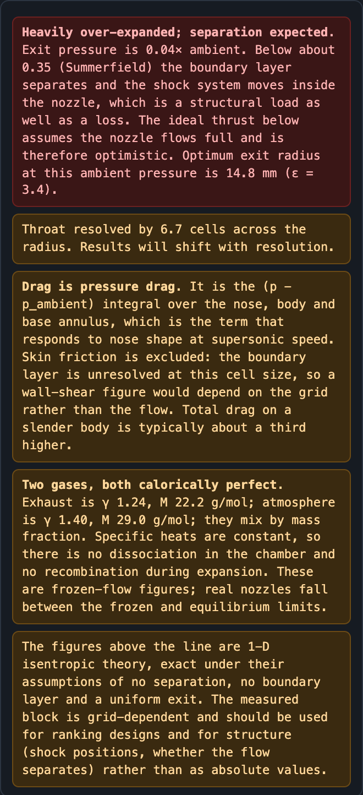

---

## Solver

Conserved state `U = (ρ, ρu_z, ρu_r, E)` as cell averages on a finite-volume grid in cylindrical
coordinates, with the 1/r terms carried through and no special case at the axis.

- HLLC approximate Riemann solver, MUSCL reconstruction with a minmod limiter, SSP-RK2 in time.
  Each side of a face carries its own γ, and the mass fraction is reconstructed alongside
  (ρ, u, p) so species and mass remain consistent at second order.
- Species flux comes from the same Riemann solve: the mass flux times the mass fraction on
  whichever side the contact wave originated.
- Low-Mach reconstruction fix (Thornber et al. 2008). Upwind dissipation grows as 1/M, and this
  problem has external flow at Mach 0.2 beside a plume at Mach 4 on the same grid.
- Reflecting-wall Riemann fluxes rather than ghost cells.
- Plenum boundary at the injector: a Dirichlet region participating normally in the flux
  computation.
- Freestream inlet imposing (ρ, u_z, p); zero-gradient outflow and far field; a sponge relaxing
  to the freestream at all three open boundaries.
- Viscous stress, viscous heating and conduction at constant Prandtl number, each cell using its
  own mixture c_p and R; species diffusion at unity Schmidt number; optional Smagorinsky
  sub-grid viscosity.
- Timestep from a GPU max-reduction of the acoustic wave speed.

Six compute dispatches per step (two RK stages × flux-z, flux-r, update). The frame is planned
on the CPU and submitted in one command encoder, with per-stage uniforms addressed by dynamic
offset.

### Not modelled

Chemistry: specific heats are constant, so there is no dissociation in the chamber and no
recombination during expansion. Figures are frozen-flow values. Also no combustion, injector
elements, radiation, ablation, film cooling or nozzle flexure; the chamber is held at a
stagnation state. Axial symmetry excludes three-dimensional shear-layer instabilities, for which
the Smagorinsky term substitutes.

---

## Video export

MP4/H.264 by default, or WebM/VP9 or VP8. WebCodecs supplies encoded chunks but no container, so
a minimal Matroska writer and a minimal MP4 writer are included.

The interactive solver chooses its timestep adaptively, which would give frames representing
unequal intervals. Export therefore runs on a fixed schedule: every frame advances the same
simulated interval, subdivided into as many equal sub-steps as stability requires. The sub-step
count varies between frames; the frame interval does not.

**Export all fields** writes one file per field from a single simulation. Stepping dominates the
cost and rendering is nearly free, so eight fields cost far less than eight runs.

The colour scale is fixed for the whole clip. Export runs the shot once to find the peak, fixes
the range, then records, caching the peak per configuration. On screen the range tracks the flow
instead.

Frames carry a burned-in clock, the configuration, thrust and drag, the colour legend and a
scale bar, in bands above and below the image.

## Shareable links

Every physical setting is serialised into the URL fragment. Only non-defaults are written and
keys are two characters. The fragment is used rather than the query string because it is not
sent to a server, and because assigning `location.hash` works on `file://` URLs where Chrome
rejects `history.replaceState`.

Back and forward restore the configuration and restart the run. Dragging a slider replaces the
current history entry; a discrete action pushes one.

## Interpretation

Structural results are reliable and reproduce across resolutions: sonic-line position, whether
the flow separates inside the bell, shock-cell spacing and Mach discs in an under-expanded
plume, whether a bow shock is attached or detached, base-flow behaviour.

The 1-D figures are exact under their stated assumptions.

The measured figures are converged to a few percent on the default grid at the throat and exit
plane, which suits ranking designs rather than quoting absolute thrust. All performance figures
are frozen-flow values, and drag is pressure drag only.

## Provenance

Forked from [BenWheatley/Airzooka](https://github.com/BenWheatley/Airzooka). The compressible
solver kernels, WebGPU plumbing, video exporter and shareable-link machinery originate there.
